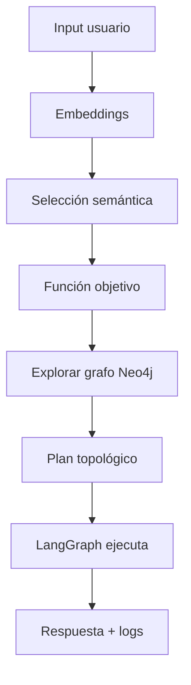

# FunctionMatcher Planner

> **Agente inteligente que orquesta funciones basadas en dependencias usando Neo4j + LangGraph**

---


---

## 📌 Resumen Ejecutivo

El **FunctionMatcher Planner** es un agente AI que resuelve solicitudes del usuario en lenguaje natural mediante un flujo de 7 pasos:

1. **Input** — Recibe query del usuario (`input()`)
2. **Embeddings** — Vectorización con herramienta open-source (Sentence Transformers ≈ LMML)
3. **Function Selection** — Búsqueda semántica por similitud coseno
4. **Exploración del grafo** — Resolución de dependencias transitivas `[:REQUIRES]`
5. **Planificación** — Orden topológico de ejecución
6. **Ejecución** — Orquestación con LangGraph (`StateGraph`)
7. **Output** — Respuesta natural + logs con timestamps

Flujo requerido en el examen:

```
Input → Embeddings → Function Selection → Exploración grafo → Plan → Ejecución → Output
```

---

## 🛠️ Stack Tecnológico

| Componente | Tecnología | Tipo | 
|------------|------------|------|
| Grafo de conocimiento | Neo4j 5.18 (Docker) | Base de datos de grafos | 
| Orquestación | LangGraph | Máquina de estados | 
| Embeddings | Sentence Transformers | Código abierto | 
| Búsqueda semántica | Similitud coseno (scikit-learn) | Matching vectorial | 
| Funciones simuladas | Python (`print()`) | Sin APIs externas | 
| Interfaz gráfica | Streamlit + PyVis | UI interactiva | 
| Visualización grafo | Neo4j Browser + PyVis | Visualización | 

---

## 🔄 Arquitectura del Sistema



---

## 🔍 Explicación del Flujo

**Input**  
Solicitud en lenguaje natural mediante `input()`.

**Embeddings**  
Vectorización de 384 dimensiones usando Sentence Transformers.

**Function Selection**  
Similitud coseno para elegir la función más relevante.

**Exploración del grafo**  
Neo4j resuelve dependencias transitivas.

**Ejecución**  
LangGraph ejecuta funciones simuladas paso a paso.

**Output**

```
[INPUT] [SELECTION] [GRAPH] [EXEC] [RESPONSE]
```

---
## 📁 Estructura del Proyecto

```bash
AgenteFuncionMatcher/
├── src/
│   └── agent/
│       ├── __pycache__/
│       ├── dependency_resolver.py   # Resolución de dependencias en Neo4j
│       ├── function_matcher.py      # Selección semántica de funciones
│       ├── functions.py             # Funciones simuladas del sistema
│       ├── init_graph.py            # Inicialización del grafo en Neo4j
│       └── planner_agent.py         # Agente principal orquestado con LangGraph
│
├── Streamlit/
│   ├── __pycache__/
│   ├── app.py                       # Interfaz gráfica principal
│   ├── styles.py                    # Estilos visuales
│   └── templates.py                 # Componentes reutilizables
│
├── .env                             # Variables de entorno
├── .env.example                     # Plantilla de configuración
├── .gitignore
├── docker-compose.yml               # Neo4j en Docker
├── requirements.txt                 # Dependencias Python
├── test_connection.py               # Prueba de conexión Neo4j
├── test_env.py                      # Verificación del entorno
└── README.md                        # Documentación del proyecto
```


---

## 🚀 Ejecución

### Requisitos

- Docker Desktop
- Python 3.11+

---

### 1️⃣ Levantar Neo4j

```bash
docker compose up -d
```

---

### 2️⃣ Inicializar grafo

```bash
python notebooks/init_graph.py
```

---

### 3️⃣ Ejecutar agente

```bash
python notebooks/planner_agent.py
```

---

### 4️⃣ Interacción ejemplo

```
💬 Usuario: Quiero comprar una laptop gamer

[SELECTION] crearPedido — 39.82%
[GRAPH] Plan generado (5 pasos)
[EXEC] obtenerInfoCliente …
…
✅ Pedido confirmado
```

---

### 5️⃣ Visualizar grafo

Abrir:

```
http://localhost:7474
```

Ejecutar:

```cypher
MATCH path=(f:Function {name:"crearPedido"})-[:REQUIRES*]->(dep)
RETURN path
```

---

## 📊 Resultados Obtenidos

| Métrica | Valor | Observación |
|---------|------|-------------|
| Funciones en grafo | 6 | Dependencias completas |
| Relaciones `[:REQUIRES]` | 9 | Transitivas |
| Función objetivo | crearPedido | Matching semántico |
| Pasos plan | 5 | Orden topológico |
| Tiempo ejecución | ~1.5 s | Flujo completo |
| Confianza selección | 39.82% | Modelo ligero |

---
## 📝 Conclusiones 

- **Integración exitosa de técnicas multivariadas con IA aplicada:**  
  Los embeddings vectoriales —fundamentados en análisis multivariado— permiten transformar texto no estructurado en representaciones numéricas que habilitan la búsqueda semántica. Esto demuestra una aplicación directa de conceptos de la asignatura en un sistema funcional de IA.

- **Grafos como modelo natural para dependencias:**  
  Neo4j representa de forma intuitiva las relaciones `[:REQUIRES]` entre funciones, facilitando la generación de planes topológicos sin necesidad de implementar algoritmos complejos manualmente. El modelo gráfico simplifica la resolución de dependencias transitivas.

- **Orquestación mediante máquinas de estado:**  
  LangGraph permite coordinar flujos de ejecución complejos de forma estructurada, asegurando trazabilidad completa mediante logs y control explícito del estado del sistema en cada paso.


---

## 👤 Autores

**Erika Contreras**  
econtrerasz@est.ups.edu.ec

**Jorge Pizarro**  
jpizarro@est.ups.edu.ec

Universidad Politécnica Salesiana — Ecuador  
Docente: Ing. Remigio Hurtado (PhD)

---
