# FunctionMatcher Planner

> **Agente inteligente que orquesta funciones basadas en dependencias usando Neo4j + LangGraph**

---


---

## 📌 Resumen Ejecutivo

El **FunctionMatcher Planner** es un agente AI que resuelve solicitudes del usuario en lenguaje natural mediante un flujo de 7 pasos:

1. **Input** — Recibe query del usuario (`input()`)
2. **Embeddings** — Vectorización con herramienta open-source (Sentence Transformers ≈ LMML)
3. **Function Selection** — Búsqueda semántica por similitud coseno
4. **Exploración del grafo** — Resolución de dependencias transitivas `[:REQUIRES]`
5. **Planificación** — Orden topológico de ejecución
6. **Ejecución** — Orquestación con LangGraph (`StateGraph`)
7. **Output** — Respuesta natural + logs con timestamps

Flujo requerido en el examen:

```
Input → Embeddings → Function Selection → Exploración grafo → Plan → Ejecución → Output
```

---

## 🛠️ Stack Tecnológico

| Componente | Tecnología | Tipo | Cumple requisito |
|------------|------------|------|----------------|
| Grafo de conocimiento | Neo4j 5.18 (Docker) | Base de datos de grafos | ✅ |
| Orquestación | LangGraph | Máquina de estados | ✅ |
| Embeddings | Sentence Transformers | Código abierto | ✅ |
| Búsqueda semántica | Similitud coseno (scikit-learn) | Matching vectorial | ✅ |
| Funciones simuladas | Python (`print()`) | Sin APIs externas | ✅ |
| Interfaz gráfica | Streamlit + PyVis | UI interactiva | ✅ |
| Visualización grafo | Neo4j Browser + PyVis | Visualización | ✅ |

---

## 🔄 Arquitectura del Sistema

```mermaid
flowchart TD
    A[Input usuario] --> B[Embeddings]
    B --> C[Selección semántica]
    C --> D[Función objetivo]
    D --> E[Explorar grafo Neo4j]
    E --> F[Plan topológico]
    F --> G[LangGraph ejecuta]
    G --> H[Respuesta + logs]
```



---

## 🔍 Explicación del Flujo

**Input**  
Solicitud en lenguaje natural mediante `input()`.

**Embeddings**  
Vectorización de 384 dimensiones usando Sentence Transformers.

**Function Selection**  
Similitud coseno para elegir la función más relevante.

**Exploración del grafo**  
Neo4j resuelve dependencias transitivas.

**Ejecución**  
LangGraph ejecuta funciones simuladas paso a paso.

**Output**

```
[INPUT] [SELECTION] [GRAPH] [EXEC] [RESPONSE]
```

---

## 📁 Estructura del Proyecto

```bash
AgenteFuncionMatcher/
├── docker-compose.yml
├── .env
├── notebooks/
│   ├── init_graph.py
│   ├── functions.py
│   ├── dependency_resolver.py
│   └── planner_agent.py
├── Streamlit/
│   ├── app.py
│   ├── styles.py
│   └── templates.py
├── requirements.txt
└── README.md
```

---

## 🚀 Ejecución

### Requisitos

- Docker Desktop
- Python 3.11+

---

### 1️⃣ Levantar Neo4j

```bash
docker compose up -d
```

---

### 2️⃣ Inicializar grafo

```bash
python notebooks/init_graph.py
```

---

### 3️⃣ Ejecutar agente

```bash
python notebooks/planner_agent.py
```

---

### 4️⃣ Interacción ejemplo

```
💬 Usuario: Quiero comprar una laptop gamer

[SELECTION] crearPedido — 39.82%
[GRAPH] Plan generado (5 pasos)
[EXEC] obtenerInfoCliente …
…
✅ Pedido confirmado
```

---

### 5️⃣ Visualizar grafo

Abrir:

```
http://localhost:7474
```

Ejecutar:

```cypher
MATCH path=(f:Function {name:"crearPedido"})-[:REQUIRES*]->(dep)
RETURN path
```

---

## 📊 Resultados Obtenidos

| Métrica | Valor | Observación |
|---------|------|-------------|
| Funciones en grafo | 6 | Dependencias completas |
| Relaciones `[:REQUIRES]` | 9 | Transitivas |
| Función objetivo | crearPedido | Matching semántico |
| Pasos plan | 5 | Orden topológico |
| Tiempo ejecución | ~1.5 s | Flujo completo |
| Confianza selección | 39.82% | Modelo ligero |

---

## 📝 Conclusiones

- Embeddings = aplicación real de análisis multivariado  
- Grafos modelan dependencias naturalmente  
- LangGraph permite orquestación robusta  
- Herramientas open source cumplen requisitos académicos  

---

## 👤 Autor

**Erika Contreras**  
Universidad Politécnica Salesiana — Ecuador  
Asignatura: Análisis Multivariado  
Docente: Ing. Remigio Hurtado (PhD)

---
